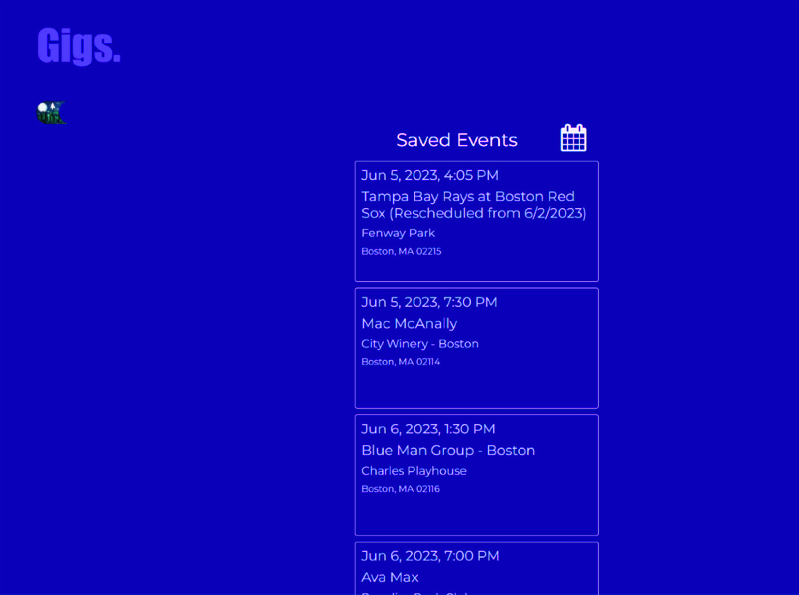

# GIGS

## Description
The app Gigs is designed to make the search of events intuitive. 
Imagine you are planning a weekend getaway and trying to figure out what events are happening in the area during your stay. 
With Gigs, you are able to do it with ease.

https://drive.google.com/file/d/143qsrUySnXwQL8AFiK9aflqWaR1lN8yq/view?usp=drive_link

 

## Use
*   Type in the city in the search bar.
*	Press the submit button.
*	You will be redirected to the results page with the results to all the events in the area. 
*	Click the calendar and get Gigs results for the date of your visit.
*	Choose your favorite event and save it to your <3 Saved events for history. 

The results update based on your preferred dates. 
When clicking on the saved button you may view all your chosen events and dates.

For convenience a weather Api was used to show the active weather data for your specified location. 

Safe travels! 

The following animation demonstrates the application's appearance and functionality:

## Result
We developed a well-crafted, functioning, user friendly, intuitive website for searching local events per your searched city. 

We incorporated server Api's that help to draw data for searching the events by city, time, location, name of the event, and added an image for each artist.
We added a fully functioning calendar which you can select a date for your event and see what Gigs are in the area. 

